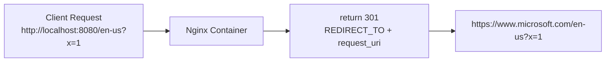

# HTTP Redirect Container 🔀


A lightweight nginx container that returns a **301 redirect** to the URL defined by `REDIRECT_TO`.

## ✨ Features

- Switch redirect target via `REDIRECT_TO`
- Preserve path and query string (e.g. `/en-us?a=1`)
- Always returns `301 Moved Permanently`
- Minimal setup (`Dockerfile` + nginx template)

## 🧠 How It Works



## 📦 Project Files

- `Dockerfile`: nginx image setup
- `nginx.conf.template`: 301 redirect config
- `docker-compose.yml`: local run settings
- `LICENSE`: MIT

## 🚀 Usage

### 1. Build image

```bash
docker build -t httpredirect .
```

### 2. Run container

```bash
docker run -p 8900:80 -e REDIRECT_TO=https://www.microsoft.com httpredirect
```

### 3. Verify

```bash
curl -I http://localhost:8900/en-us
```

Expected response:

- `HTTP/1.1 301 Moved Permanently`
- `Location: https://www.microsoft.com/en-us`

## 🧪 Docker Compose (Dev)

`docker-compose.yml` is bound to localhost only:

- `127.0.0.1:8080:80`

Run:

```bash
docker compose up --build
```

## 🔐 Security Notes

- Use a trusted fixed URL for `REDIRECT_TO`
- Restrict `REDIRECT_TO` management in production
- Pin base image version/digest when needed

## 📄 License

MIT License (`LICENSE`)
